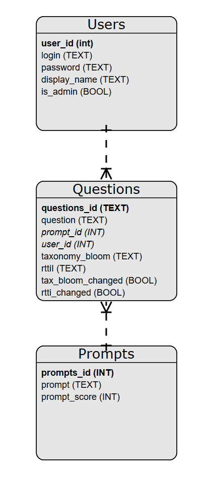

# Werkplaats 2 2024 - TestGPT

# Wijzigingen

| Datum       | Omschrijving wijziging                                                                                                                                                                                                                             |
|-------------|----------------------------------------------------------------------------------------------------------------------------------------------------------------------------------------------------------------------------------------------------|
| 2024-10-01  | Eerste versie                                                                                                                                                                                                                                      |
| 2024-11-12  | - Bijlages met voorbeeld uitwerking toegevoegd<br/>- Database tabellen hebben date_created kolom<br/>- Foreign key in vragen gefixed<br/>- Correcte telling per vraag naar prompts tabel verplaatst<br/>- Database creator & database.db aangepast |

# Inleiding
Deze opdracht hebben we aangenomen van Test-Correct (https://www.test-correct.nl/). Test-Correct maakt een toetsplatform gericht op een andere manier van leren. Zij leggen de nadruk op het gezamenlijk nakijken en bespreken van toetsen. Daarvoor dienen de toetsen zelf dus ook uitgevoerd te worden in het test-correct platform. En daaruit volgt dat ook de vragen in het test-correct platform moeten worden ingevoerd.

Test-Correct probeert daarin de docenten zo veel mogelijk te helpen, met bijvoorbeeld een enorme databank met vragen die ze kunnen gebruiken. Een groot deel daarvan is nog niet gescoord op de taxonomie van Bloom (https://wij-leren.nl/taxonomie-van-bloom.php) en RTTI (https://www.slo.nl/handreikingen/havo-vwo/handreiking-se-bio-hv/toetsen-schoolexamen/artikel/rtti/). Hij wil dat redacteuren nog niet gescoorde vragen kunnen lezen, een voorstel te laten doen met AI en eventueel aan te passen.

Met de tijd wil hij dit geautomatiseerd laten doen. Maar hoe kom je tot een goede prompt? Daar wil hij een test applicatie voor hebben, die het effect van verschillende prompts laat zien en de redacteuren de optie geeft om nieuwe prompts te maken. Door bij te houden hoe vaak redacteuren het antwoord van AI aanpassen denkt hij de prompt te kunnen tunen, nieuwe versies van te publiceren en daarvan het resultaat te kunnen meten. 

De gescoorde vragen kunnen worden geëxporteerd, zodat ze kunnen worden toegevoegd aan de beoordeelde vragen in de Test-Correct database.

# Opdracht & requirements
Wat je krijgt is de volgende workflow:
- Er wordt een export aangeleverd van vragen, met antwoorden, in JSON formaat. Deze bevat onder andere een uniek Test-Correct ID. Deze kan worden ingelezen, bijvoorbeeld via een file-upload of vanuit een vaste directory.
- Vragen met hetzelfde Id worden overschreven. 
- Als een redacteur de applicatie opent (inlogt) ziet hij een lijst met alle nog niet gescoorde vragen. 
- Een redacteur kan een vraag openen. Deze kiest de laatst gekozen prompt, maar de redacteur kan een andere prompt kiezen. Met een druk op de knop wordt de vraag gescoord op RTTI en Bloom. De redacteur kan het antwoord eventueel aanpassen. De vraag wordt opgeslagen met prompt, gegevens van de redacteur en de uiteindelijke score,
- In de database wordt de prompt gescoord hoeveel vragen er *niet* zijn aangepast aan de hand van het voorstel en hoeveel *wel*. Dit bepaalt de succes score. 
- Na opslaan verschijnt een volgende vraag. 
- Bovenin is er een optie om alle gescoorde vragen te exporteren naar JSON. Deze worden daarna *uit* de database verwijderd (of gearchiveerd).

We kunnen deze eisen opdelen in een aantal deelcomponenten:
### Inloggen
Elke redacteur heeft een eigen inlog. Zo kan er worden bijgehouden wie welke vragen heeft beoordeeld. 
- De inloggegevens zijn niet herkenbaar opgeslagen in de database.
- Er is een admin die nieuwe redacteuren kan aanmaken, of bestaande redacteuren admin kan maken.
- Het is mogelijk de gegevens van de redacteur te wijzigen  en op te slaan als admin.

Een voorbeeld van hoe je dit proces zou kunnen implementeren is te vinden in bijlage 2.1. 

### Het vragenoverzicht
Dit is de pagina die je als redacteur al eerste te zien krijgt. Deze pagina toont vragen die nog niet beoordeeld (gescoord) zijn. De redacteur kan een vraag kiezen door op de vraag of op een knop te klikken. Het vragenoverzicht kun je vinden in het volgende bestand op de repository: questions_extract.json. ler er op dat je niet alle gegevens nodig hebt uit de jason. 
- De database is groot. Het aantal vragen wordt beperkt tot een redelijk aantal, maar niet meer dan 20. Je kunt kiezen om naar volgende pagina's te navigeren.

### De workflow
Op deze pagina kun je de gekozen vraag lezen. Je kunt kiezen uit eerder gebruikte prompts, maar het is ook mogelijk om een nieuwe prompt te schrijven. Naast de prompt kies je de taxonomie die je wilt voorleggen aan CHATGPT. De taxonomie die je terugkrijgt kun je vervolgens aanpassen voordat het wordt opgeslagen.
- Er is een pagina met de vraag en een keuze uit prompts. Hierbij wordt de laatst gebruikte prompt als eerste aangeboden. Er kan worden gekozen voor een andere aangepaste prompt.
- Na de beoordeling door chatgpt is er een pagina die de taxonomie toont met de gebruikte prompt en vraag. De redacteur kan hier de taxonomie aanpassen voordat het wordt opgeslagen in de database.
- Bij het opslaan wordt de vraag, prompt, taxonomie en de gegevens van de redacteur opgeslagen in de database.
- Het is belangrijk dat er wordt bijgehouden of de taxonomie is aangepast, of dat de taxonomie uit chatgpt is opgeslagen.

Een voorbeeld van hoe het CRUD proces rondom de prompts te maken is te vinden in bijlage 2.3. Een voorbeeld van de lijst met toetsvragen en hoe je de taxonomieën kunt opslaan is te vinden in bijlage 2.2.

### Export functie
Bij het exporteren worden alle beoordeelde vragen en de taxonomieën per vraag opgeslagen in json formaat.
- Er is een pagina die de beoordeelde vragen toont. Op deze pagina kun je kiezen om alles of een deel van de beoordeelde vragen te exporteren.
Een voorbeeld van de export ziet er als volgt uit: 
```json
[ 
  {
    "question_id": "636634A859744F76A723244C27E9606D",
    "question": "Hoe ziet de aminozuurvolgorde eruit van een eiwitketen die met dit RNA wordt opgebouwd, te beginnen vanaf de linkerkant (5'-kant)?",
    "taxonomie": "Onthouden",
    "rtti": "Reproductie"
   }
]
```

### Bonus doelen
- Maak de keuze van prompt vrij en bijbehorend resultaat. Dus geef de optie om een type prompt te kiezen (Bloom, RTTI en er waren er nog een paar), een resultaat veld in te vullen en deze los bij te houden. 
- Implementeer bij kiezen van prompt ook een keuze voor de leverancier ( Bard of Gemini)

### Stijl en opmaak
Test-correct heeft een huisstijl, met een exact kleurenpalet en lettertype. We willen dat je deze huisstijl gebruikt, maar we hebben deze niet meegekregen van de opdrachtgever, je zult dus zelf een stylesheet moeten maken (of deels kopiëren). Je kunt je laten inspireren door https://www.test-correct.nl/welcome.

# Technische details

### Over de requirements
De lijst met functionaliteiten is opgesteld in volgorde van prioriteit. Dat wil zeggen, de opdrachtgever vind de eerste zaken in de lijst het belangrijkst. Hou daar rekening mee in de planning - verzoeken die klinken als "zou willen" of "het zou mooi zijn als" zou je bijvoorbeeld in een latere sprint uitvoeren dan de zaken die klinken als "moet". 

We gaan leren werken met scrum. De requirements zijn niet één op één vertaalbaar naar stories. Vaak zul je zaken tegenkomen in de requirements die een eigen story nodig hebben. Discussieer met je team over hoe je stories zo klein mogelijk kunt maken met een duidelijke "definition of done".

### ChatGPT
Kijk in de repo naar een beschrijving in chatgpt.md.

### Database
We maken gebruik van SQLite. Dit is een database die je in een bestand opslaat. Anders dan bijvoorbeeld "MySQL" heb je geen netwerk adres en geen gebruikersnaam en wachtwoord nodig en je kunt de database in je Git repository opslaan. Dat is niet iets wat je normaal zou doen, maar in deze opdracht is dat wel de handigste manier om samen te werken.

Wij hebben dit bestand nu in de map "databases" geplaatst, als testgpt.db. Het staat je vrij om deze aan te passen naar jouw eigen behoeften en om de naam, locatie etcetera te wijzigen. De structuur daar is zoals wij denken dat die handig is voor de eerste werkzaamheden, maar je bent er niet aan gebonden. Sommige requirements vragen ook om wijzigingen in de database, dus je zult deze sowieso moeten aanpassen.

Een klein voorbeeld om database gebruik aan te tonen: 
```python
import sqlite3

# Locatie van het database bestand
database_file = "databases/testgpt.db"
# Maak verbinding met het database bestand
conn = sqlite3.connect(database_file)   
# Geef het resultaat in een dictionary in plaats van een lijst
conn.row_factory = sqlite3.Row
# Maak een cursor object waarmee je SQL statements kan uitvoeren
c = conn.cursor()
# Voer een SQL statement uit
result = c.execute("SELECT count(*) AS teacher_count FROM teachers")
# Nu niet nodig, maar stel dat dit een UPDATE statement was, dan had je nu moeten committen
# conn.commit()
number_of_teachers = result.fetchone()["teacher_count"]
print(f"Er zijn {number_of_teachers} docenten in de database")
# Sluit de verbinding met de database, is netjes, moet niet
conn.close()
```

In lib/databases/database_generator.py vind je een script dat de database aanmaakt en vult met een aantal testgegevens. Je kunt de SQL in dit script aanpassen om de database opnieuw te genereren en te wijzigen. Let erop dat deze de bestaande database altijd overschrijft. Je bent de huidige data dus *kwijt* als je dit script uitvoert. Je zou eventueel dit script kunnen uitbreiden met extra testdata.

# Technische requirements

### Technieken
Er komen een aantal verplichte technieken kijken bij deze opdracht: 
- HTML/CSS
- SQL en database gebruik 
- HTML genereren met Jinja2
- De Python Flask module, in een virtual environment
We verwachten in ieders individuele bijdrage al deze zaken terug te zien.

Daarnaast zijn er een aantal zaken die we je vragen NIET te gebruiken: 
- ORM (Object Relational Mapping) zoals SQLAlchemy. Je zult veel tutorials tegenkomen, maar we willen dat je in deze opdracht de SQL statements zelf schrijft. In volgende werkplaatsen mag je wel ORM  gebruiken.
- Javascript. De webapplicatie wordt veel beter van javascript gebruik, maar we hebben voorgaande jaren gezien dat niet iedereen in de teams kan meekomen met zo veel nieuwe techniek in één blok. Als het hele team al ervaring heeft met javascript is gebruik toegestaan.  
- Andere Python web frameworks. In latere werkplaatsen mag je wel afwijken van Flask.

Voor de verdere specifieke requirements verwijzen we je naar de WP2 introductie presentatie op Teams.

### Producten
We verwachten dat je de volgende producten oplevert in deze werkplaats:
- Een werkende web applicatie in Flask, die voldoet aan de technische en functionele requirements
- HTML pagina's met een correcte opmaak en huisstijl, gegenereerd met Jinja2
- Een SQLite database bestand met de juiste structuur en testdata
- Een README.md bestand in de root van je Git repository, met daarin een aantal zaken: 
  - Een korte beschrijving van de applicatie
  - Een lijst met gebruikte bronnen zoals tutorials, documentatie, ChatGPT prompts etcetera. Gebruik de APA7 standaard. 
  - Een uitleg met hoe een virtual environment te creëren en de applicatie te starten
- De Github issues moeten een goed overzicht geven van de stories die je hebt gemaakt en de taken die je hebt uitgevoerd. Als je geen Github stories hebt gebruikt dien je een export in te voegen met een overzicht van de taken die je hebt uitgevoerd.

### Code kwaliteitseisen
We verwachten dat je code netjes is en dat je je aan de Python conventies houdt. Dat betekent onder andere:
- De code voldoet aan de WP1 regels rondom "spaghetti code" en code duplicatie. Gebruik functies, correcte benamingen, geen "magic numbers", etcetera.
- De code voldoet aan de PEP8 standaard. Je kunt de PEP8 standaard controleren met de `flake8` module.
- De code gebruikt het MVC patroon om de code te scheiden in lagen. 
 
Ook voor de verdere eisen rondom opleveren en code kwaliteit verwijzen we je naar de WP2 introductie presentatie op Teams.

# Bijlages

## Bijlage 1: Database ERD
De initiële database structuur is als volgt:



## Bijlage 2: Voorbeeld uitwerkingen
Deze bijlages bevatten een aantal voorbeelden van hoe je de requirements zou kunnen uitwerken. Het staat jou geheel vrij deze te gebruiken en na te bouwen, of om je eigen oplossing te bedenken.

### Bijlage 2.1: Inloggen en redacteuren

We stellen voor om redacteuren te laten inloggen met een e-mail adres als loginnaam.


De lijst met redacteuren kan er als volgt uitzien. De knop "Nieuwe redacteur" en de kolom "Wijzg" zou alleen getoond worden als de ingelogde redacteur een admin is:


Door de klikken op een redacteur kan je de gegevens van de redacteur wijzigen. Hier zou je ook een "verwijderen" knop kunnen toevoegen, dat houdt de lijst met redacteuren overzichtelijker dan als we de knop daar plaatsen. Deze knop is alleen zichtbaar voor admins:


Een nieuwe redacteur toevoegen zou er als volgt uit kunnen zien:


### Bijlage 2.2: Vragenoverzicht en taxonomie
Het vragenoverzicht zou er als volgt uit kunnen zien. 
- De knop "Volgende" zou alleen zichtbaar zijn als er meer vragen zijn dan er getoond worden.
- De opties om te filteren worden pas actief als er op de knop "ververs" wordt gedrukt. 
- De knop "indexeer" is alleen zichtbaar bij vragen die nog geen taxonomie hebben
- Bij exporteren wordt er een JSON bestand gegenereerd en aangeboden om te downloaden. Vragen die zijn gedownload worden gemarkeerd of verwijderd uit de database.
 


Nadat er op de knop "indexeer" wordt gedrukt in de lijst met toetsvragen wordt er een tussenscherm geopend met de gehele vraag en de mogelijkheid om een prompt uit de lijst (zie bijlage 2.3) te kiezen:


Na de keuze voor een prompt uit de lijst wordt ChatGPT of onze andere AI agent gevraagd met de gekozen prompt om de vraag in te delen. De redacteur kan de taxonomie aanpassen voordat deze wordt opgeslagen. Van belang is bij het opslaan dat we bijhouden of de taxonomie is aangepast of niet - als de redacteur de taxonomie niet heeft aangepast telt het als "goed gecategoriseerd", past de redacteur de taxonomie aan dan telt het als "fout gecategoriseerd":


### Bijlage 2.3: Prompts
We moeten dus ook CRUD schermen maken om de prompts te beheren. Dit zou er als volgt uit kunnen zien. De kolom "toetsvragen ingedeeld" geeft aan hoe vaak de prompt is gebruikt:


Het details scherm toont de prompt en de taxonomie die de prompt oplevert. In de details staan het totaal aantal keer dat deze prompt is gebruikt, het aantal keer dat de redacteur de taxonomie heeft overgenomen en het aantal keer dat de redacteur de taxonomie heeft aangepast. Een prompt verwijderen zou alleen mogen door de admin of de maker van de prompt:


Een nieuwe prompt maken is niet zo complex. We hebben alleen een label nodig en een tekstveld voor de prompt:


